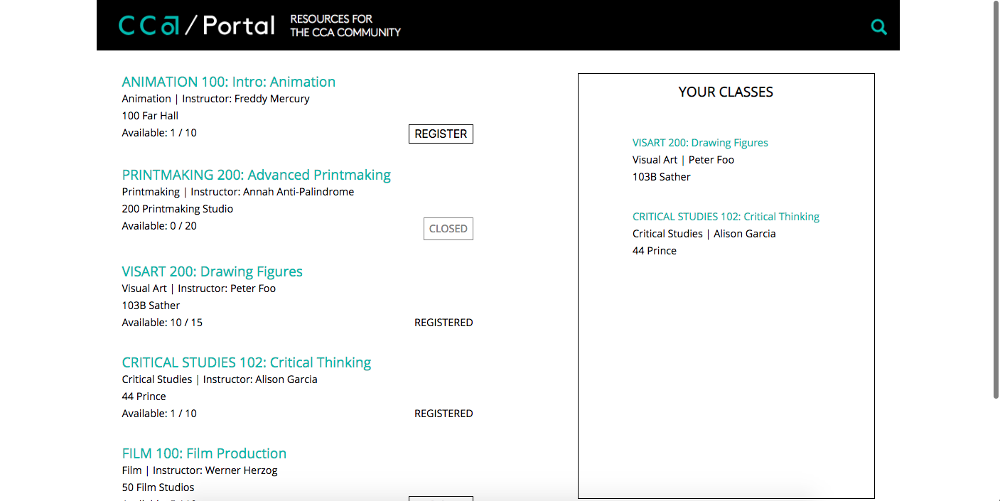
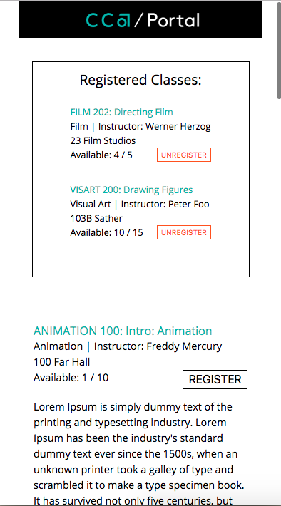

# cca-frontend

This project was bootstrapped with [Create React App](https://github.com/facebook/create-react-app).

## Challenge:
Create a single page app that displays class information, and allows students to register for open classes and see which classes they have registered for. No database required. 

## About:
This is the React frontend for the app. The backend for this app was built with Django and can be found on another
<a href='https://github.com/natalie-poulson/cca'>repo</a>

## Features:
* An API that displays a JSON file containing information on classes and serves as the endpoint for front-end server requests
* Displays a list of classes and basic information about that class
  * If there is space available in the class, there is a "REGISTER" button
    * When user clicks "REGISTER", the "Available" count goes down by one and that class information is displayed on the user's "YOUR CLASSES" list
  * If a class is full, the class reads "CLOSED" and the user cannot register for it
* Responsive Design

## Screenshots:
### On larger devices:

### On smaller devices:

